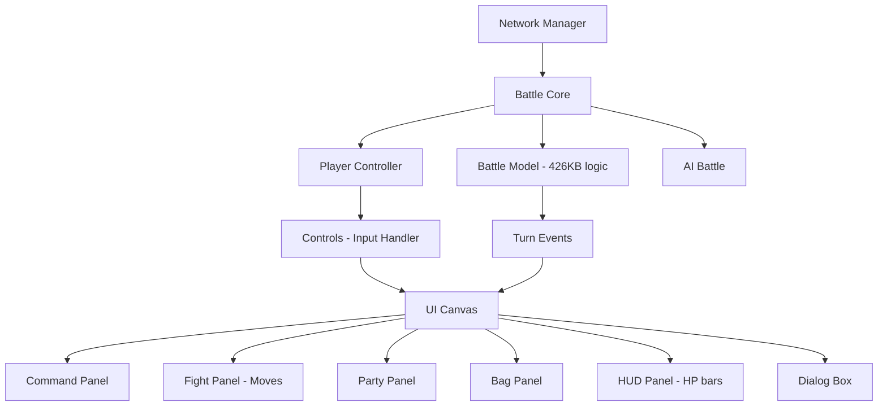

# PBS Unity - Analysis for Battle UI Project

## Overview

**PBS (Pokemon Battle Simulator)** la mot project Unity open-source mo phong he thong battle Pokemon Gen 8, su dung **Mirror** cho PvP networking. Project nay co nhieu thanh phan UI, AI, va networking co the tham khao hoac tai su dung cho battle project cua ban.

> [!IMPORTANT]
> Day la project **reference/learning**, khong nen copy truc tiep ma nen hieu kien truc roi adapt cho project cua minh.

---

## Architecture Overview



---

## 1. UI System (Reusable cao nhat)

### 1.1 Canvas Orchestrator
- **File**: [Canvas.cs](file:///Users/nergy/lt-mcb-NT106.Q22.ANTT/tools/pbs-unity/Assets/PBS/Scripts/Battle/View/UI/Canvas.cs)
- **Pattern**: Single Canvas quan ly tat ca UI panels qua enum-based state switching
- **Panels co san**:
  | Panel | Chuc nang | File |
  |-------|-----------|------|
  | **Command Panel** | Menu chinh (Fight/Bag/Party/Run) | `Panels/Command/` |
  | **Fight Panel** | Chon move + Mega/Z-Move/Dynamax | `Panels/Fight/` |
  | **Field Target Panel** | Chon muc tieu (doubles) | `Panels/FieldTarget/` |
  | **Party Panel** | Chon Pokemon trong team | `Panels/Party/` |
  | **Bag Panel** | Chon tui do | `Panels/Bag/` |
  | **Bag Item Panel** | Chon item cu the | `Panels/BagItem/` |
  | **HUD Panel** | HP bars, status, level | `HUD/` |

> [!TIP]
> Pattern `SwitchPanel(Enums.Panel)` rat hay - co the adapt truc tiep cho battle UI cua ban:
> ```csharp
> public void SwitchPanel(Enums.Panel newPanel) {
>     currentPanel?.gameObject.SetActive(false);
>     currentPanel = GetPanel(newPanel);
>     currentPanel?.gameObject.SetActive(true);
> }
> ```

### 1.2 HUD System (HP Bar Animation)
- **File**: [Panel.cs](file:///Users/nergy/lt-mcb-NT106.Q22.ANTT/tools/pbs-unity/Assets/PBS/Scripts/Battle/View/UI/HUD/Panel.cs)
- **Features**:
  - HP bar voi 3 mau: xanh (>50%), vang (25-50%), do (<25%)
  - Animation HP change smooth bang Coroutine
  - Hien thi: name, gender icon (mau), level, status condition
  - Support Single/Double/Triple battle layout
- **Code mau HP animation** (line 253-299): Lerp `fillAmount` theo thoi gian, update text + mau dong thoi

### 1.3 Dialog/Text System
- **File**: [Dialog.cs](file:///Users/nergy/lt-mcb-NT106.Q22.ANTT/tools/pbs-unity/Assets/PBS/Scripts/Battle/View/UI/Dialog.cs)
- **Features**:
  - Typewriter effect (tung ky tu)
  - Rich text formatting: `\b` (bold), `\i` (italic), `\u` (uppercase), `\c<color>\` (color)
  - Auto text overflow/pagination
  - Nhieu che do: instant, timed, hold-for-input
- **Rat huu ich**: Co the adapt toan bo he thong dialog nay cho battle log cua ban

### 1.4 UI Prefabs
| Prefab | Mo ta |
|--------|-------|
| `BTLUI_PokemonHUD.prefab` | HP bar lon (near/player) |
| `BTLUI_PokemonHUDSmall.prefab` | HP bar nho (far/enemy) |
| `CmdBtn.prefab` | Nut command (Fight, Bag, Party, Run) |
| `FightBtn.prefab` | Nut move |
| `FightSpecialBtn.prefab` | Nut Mega/Z-Move/Dynamax |
| `PartyBtn.prefab` | Nut chon Pokemon |
| `ItemBtn.prefab` | Nut chon item |
| `FieldTargetBtn.prefab` | Nut chon target |

### 1.5 UI Graphics Assets
- **Folder**: [Graphics/UI/Battle/](file:///Users/nergy/lt-mcb-NT106.Q22.ANTT/tools/pbs-unity/Assets/PBS/Graphics/UI/Battle)
- Co san: BW2 style battle UI sprites, arrow icons, panel backgrounds cho Command/Move/Party/Bag/HUD

---

## 2. Event System (View Events)

- **File**: [Event.cs](file:///Users/nergy/lt-mcb-NT106.Q22.ANTT/tools/pbs-unity/Assets/PBS/Scripts/Battle/View/Event.cs)
- **Pattern**: Class hierarchy cho moi loai su kien battle
- **Events co san**:
  - `StartBattle`, `EndBattle`
  - `Message`, `MessageParameterized` (dialog text)
  - `CommandGeneralPrompt`, `CommandReplacementPrompt` (player input)
  - `TrainerSendOut`, `TrainerWithdraw`, `TrainerItemUse`
  - `PokemonHealthDamage`, `PokemonHealthHeal`, `PokemonHealthFaint`, `PokemonHealthRevive`
  - `PokemonMoveUse`, `PokemonMoveHit` (voi hit targets, effectiveness, critical)
  - `PokemonStatChange`, `PokemonAbilityActivate`
  - `PokemonChangeForm`, `PokemonSwitchPosition`

> [!TIP]
> Day la pattern rat tot de tach biet **battle logic** va **UI rendering**. Event duoc tao tu Model, gui sang View de hien thi.

---

## 3. AI System

- **File**: [Battle.cs](file:///Users/nergy/lt-mcb-NT106.Q22.ANTT/tools/pbs-unity/Assets/PBS/Scripts/AI/Battle.cs)
- **Trang thai hien tai**: AI don gian - **chon random move**
- **Architecture**: 
  - `GetCommandsByPrompt()` - Nhan trainer + pokemon list, tra ve commands
  - `SelectCommand()` - Chon command tot nhat (hien tai random)
  - `GetBestCommand()` - Placeholder cho scoring system
  - Support switch Pokemon khi can

> [!WARNING]
> AI nay **rat co ban** - chi random move. Conversation truoc cua ban ([a278db2c](file:///Users/nergy/.gemini/antigravity/brain/a278db2c-b34e-4b9c-b598-368ea3a899fb/.system_generated/logs/overview.txt)) da de cap can **enemy AI strategy**. PBS cho ban cai khung (framework), nhung can tu implement scoring logic.

---

## 4. Networking (Mirror)

- **Files**: [Manager.cs](file:///Users/nergy/lt-mcb-NT106.Q22.ANTT/tools/pbs-unity/Assets/PBS/Scripts/Networking/Manager.cs), [Core.cs](file:///Users/nergy/lt-mcb-NT106.Q22.ANTT/tools/pbs-unity/Assets/PBS/Scripts/Networking/Core.cs) (959KB!), [Player.cs](file:///Users/nergy/lt-mcb-NT106.Q22.ANTT/tools/pbs-unity/Assets/PBS/Scripts/Networking/Player.cs)
- **Features**:
  - PvP qua Mirror networking
  - Human + AI trainer support
  - Team creation (1v1, 2v2)
  - Sync trainer/team data toi client

> [!NOTE]
> Project ban la **NT106** (Mang may tinh), nen phan networking nay **rat lien quan** - co the tham khao cach PBS dung Mirror de sync battle state giua 2 players.

---

## 5. Data Models

- **Folder**: [Scripts/Data/](file:///Users/nergy/lt-mcb-NT106.Q22.ANTT/tools/pbs-unity/Assets/PBS/Scripts/Data)
- **Models co san**: Pokemon, Move, Ability, Item, ElementalType, Status (Pokemon/Battle/Team), Nature
- **Pattern**: Moi entity la class voi properties, databases la in-memory Dictionary

---

## 6. Battle Logic (Model.cs)

- **File**: [Model.cs](file:///Users/nergy/lt-mcb-NT106.Q22.ANTT/tools/pbs-unity/Assets/PBS/Scripts/Battle/Model.cs) - **426KB** (!!)
- Chua toan bo battle logic: damage calculation, type effectiveness, status effects, weather, terrain, abilities, items...
- Day la file **lon nhat** va chua nhieu logic co the tham khao

---

## Danh gia muc do huu ich cho project cua ban

| Component | Muc do ap dung | Ly do |
|-----------|---------------|-------|
| **UI Panel Switching** | Cao | Pattern SwitchPanel co the dung truc tiep |
| **HP Bar + Animation** | Cao | Copy va adapt - code sach, tot |
| **Dialog/Text System** | Cao | Typewriter effect, rich text formatting |
| **Event System** | Cao | Tach biet logic/UI - best practice |
| **UI Prefabs/Sprites** | Trung binh | Pokemon-style, can redesign cho RPG cua ban |
| **Networking (Mirror)** | Cao | Lien quan NT106, tham khao sync battle state |
| **AI Framework** | Thap-Trung binh | Chi framework, logic con random |
| **Battle Logic** | Trung binh | Qua phuc tap, chi tham khao patterns |
| **Data Models** | Trung binh | Pattern tot nhung data khac (Pokemon vs RPG) |

---

## Goi y tiep theo

1. **UI**: Adapt `Canvas.cs` panel system + `HUD/Panel.cs` HP animation cho RPG battle UI
2. **Dialog**: Port `Dialog.cs` typewriter system
3. **Events**: Tao event classes tuong tu cho RPG combat (AttackEvent, DefendEvent, SkillEvent...)
4. **Networking**: Nghien cuu `Core.cs` + `Player.cs` cho PvP sync (lien quan NT106)
5. **AI**: Xay dung scoring system tren framework AI co san

> [!IMPORTANT]
> Ban muon toi di sau vao phan nao? Vi du:
> - Adapt UI system cho RPG battle?
> - Phan tich chi tiet networking cho PvP?
> - Port HP bar animation?
> - Hoc event-driven architecture tu PBS?
